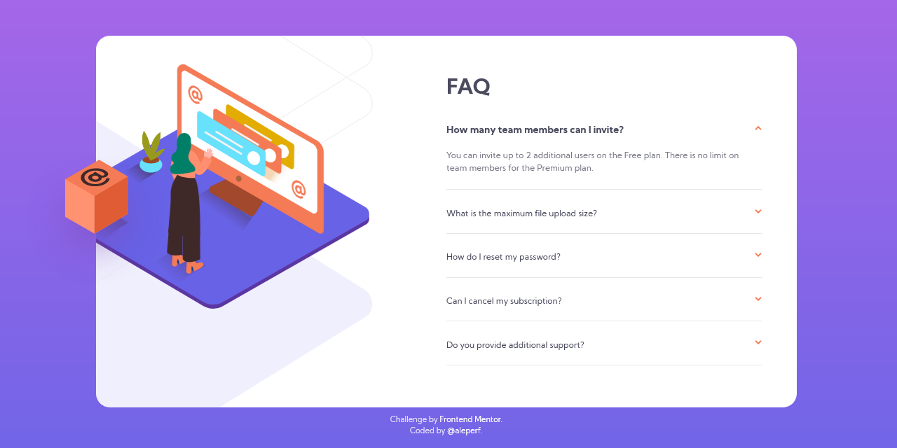
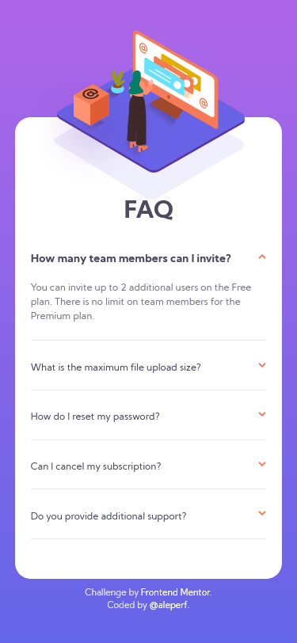
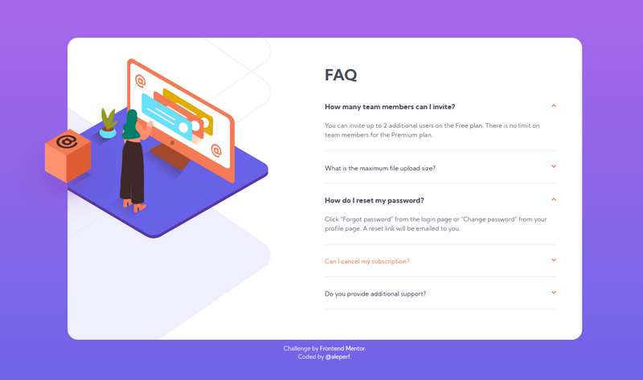

# Solution to the FAQ accordion card challenge on Frontend Mentor.

This is my solution to the [FAQ accordion card challenge on Frontend Mentor](https://www.frontendmentor.io/challenges/faq-accordion-card-XlyjD0Oam), realized using only HTML and SCSS.

## Table of contents

- [Overview](#overview)
  - [The challenge](#the-challenge)
  - [Screenshot](#screenshot)
  - [Links to code and live version](#links)
- [My process](#my-process)

  - [Built with](#built-with)

- [Author](#author)

## Overview

### The challenge

The challenge consists in building a responsive accordion, a graphical element of stacked items that can be clicked to reveal more content.

For this challenge, as per specification, the user should be able to :

- View the optimal layout for the component depending on their device's screen size
- See hover states for all interactive elements on the page.
- Hide/Show the answer to a question when the question is clicked.

### Screenshot

Below a screenshot of the mobile version of the app at 375px width.

And below another screenshots of the desktop app showing more than one tab open and the hover effect on a FAQ.

### Links

- Solution URL: [the FAQ accordion on github](https://github.com/aleperf/faq-accordion-car) (if you reading this README on github, this is the page you are watching).
- Live Site URL: [whatch the live solution on github pages](https://aleperf.github.io/faq-accordion-card/)

## My process

There are several ways to build an accordion and the first decision is about the UX: should the user be able to open more than one tab at the time? Or this should be a classic accordion in which only one element can be opened at a time?
 
The first solution offers more flexibility to the user, the second makes the UI less cluttered with information. In the end I decided for the first solution: the user should be able to read all the information needed.

Once decided the strategy, the decision has been about the tactic: how to implement the accordion? The Frontend Mentor site suggested that a solution with only HTML and CSS and no javascript was considered a "bonus" solution, so in the end it was pretty simple: I transformed a series of checkboxes in an accordion. I took advantage of the fact that when a checkbox or its label is clicked the browser add the attribute "checked" to the element, so every kind of element following the checkbox can be styled differently for both cases: a style when the checkbox is checked, and another when the checkbox isn't checked.
The checkbox doesn't even need to be visible: it can be hidden, leaving the label to act as an element to toggle. The label can contain an image (the arrow in the pictures) that is considered part of the label itself, therefore clickable.

### Built with

- HTML5 markup
- SASS/CSS
- Flexbox
- Mobile-first workflow

## Author

- [@aleperf](https://github.com/aleperf)
